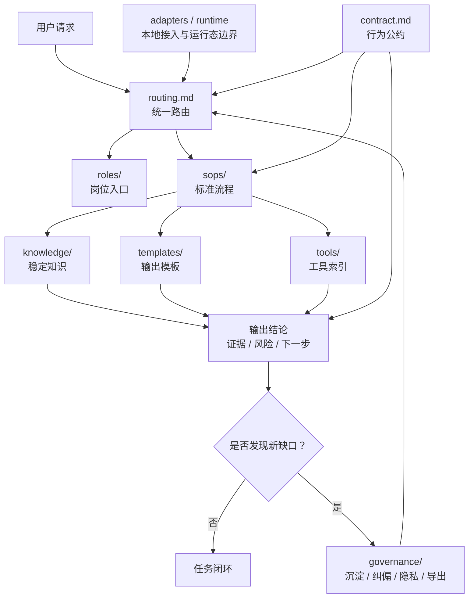

# Agents SOP Starter

> 一个用于搭建团队 Agent 工作规范的通用 starter。
> 它帮助团队把岗位职责、标准流程、经验知识、工具说明和治理规则组织到同一套目录里，让 Agent 不只是回答问题，而是能按可复用的 SOP 稳定协助工作。

## 这是做什么的

`agents-sop-starter` 是一套可复制、可改造、可分享的 Agent SOP 框架模板。

它适合用来：

- 把团队高频工作整理成可执行的 SOP。
- 给不同岗位建立统一的 Agent 入口和协作边界。
- 把测试、研发、运营、客服等角色的经验沉淀成知识卡和模板。
- 管理 Agent 使用过程中的路由、纠偏、脱敏、自动化和版本演进。
- 作为团队内部 Agent 框架、个人备份框架或公开分享框架的起点。

这不是某个具体业务系统的资料库，也不是开箱即用的账号/工具配置包。它提供的是一套通用结构和写法，使用者可以在此基础上填入自己团队的岗位、流程、知识和工具。

## 核心组成

| 底座能力 | 文件 / 目录 | 解决什么 |
|------|------|------|
| 行为公约 | `contract.md` | 约束输出、证据、安全边界和交付自检 |
| 任务路由 | `routing.md` | 从一句话请求定位岗位、SOP 或治理入口 |
| 岗位入口 | `roles/` | 描述谁负责、什么时候接管、常用 SOP 是什么 |
| 标准流程 | `sops/` | 保存可重复执行、可培训、可检查的 SOP |
| 知识沉淀 | `knowledge/` | 保存稳定经验、术语、口径和事实 |
| 底座治理 | `governance/` | 管理沉淀、隐私、路由、导出、自动化和技能生命周期 |
| 复制模板 | `templates/` | 快速创建岗位卡、SOP、知识卡和路由项 |
| 本地接入 | `config-templates/` | 让 Codex / Claude / 其他 Agent 接入本底座 |
| 扩展骨架 | `adapters/`、`tools/`、`runtime/`、`collab/`、`case-studies/`、`archive/` | 承接接入、工具、运行态、协作、案例和归档 |

## 底座架构



一句话理解：

```text
contract 负责边界，routing 负责找路，roles 负责岗位入口，
sops 负责流程执行，knowledge 负责事实沉淀，governance 负责持续补缺口。
```

## 目录结构

```text
agents-sop-starter/
├── README.md                         ← 框架导航：先读这里，了解底座能力和目录
├── contract.md                       ← Agent 最小公约：输出、证据、安全和交付自检
├── routing.md                        ← 统一任务路由：把用户请求导向岗位 / SOP / 治理入口
├── adapters/                         ← 多宿主接入说明：Codex、Claude 等如何接入本底座
│   └── README.md                     ← Adapter 边界和入口说明
├── tools/                            ← 工具索引：只放工具说明，不放凭证和运行态
│   └── README.md                     ← 工具登记格式和安全边界
├── runtime/                          ← 运行态边界：状态、缓存、日志和本机配置应放哪里
│   └── README.md                     ← 运行态不入 public / private 同步的规则
├── roles/                            ← 岗位入口：谁负责、何时接管、常用 SOP
│   ├── README.md                     ← 岗位卡创建说明
│   └── qa.example.md                 ← 测试岗位示例卡
├── sops/                             ← 标准作业流程：可重复执行、可培训、可检查
│   ├── README.md                     ← SOP 创建说明
│   └── qa/                           ← 测试域公开安全示例
│       └── functional-test-sop.example.md
├── knowledge/                        ← 稳定知识：术语、口径、经验卡、事实说明
│   ├── README.md                     ← 知识层说明
│   └── testing/                      ← 测试域知识卡示例
│       ├── defect-writing.knowledge.md
│       ├── result-layering.knowledge.md
│       └── triage-rules.knowledge.md
├── governance/                       ← 框架治理：沉淀、纠偏、分享、自动化和生命周期
│   ├── README.md                     ← 治理规则索引
│   ├── architecture.md               ← 框架结构分层和依赖关系
│   ├── asset-registry.md             ← 资产目录与 public/private/internal 标记
│   ├── automation-rules.md           ← 定时任务、后台同步、不要新开会话
│   ├── change-control.md             ← 变更分级、推送、删除和外部写入门禁
│   ├── export-profiles.md            ← public starter / private backup / internal package 分级
│   ├── integrity-checklist.md        ← 框架完整性检查清单
│   ├── maintenance-rules.md          ← 目录维护和最小联动规则
│   ├── privacy-and-share-boundary.md ← 分享边界与脱敏规则
│   ├── routing-maintenance.md        ← 路由维护与冲突处理
│   ├── self-correction.md            ← 自动纠偏机制：发现偏差时如何回到正确路径
│   ├── sedimentation.md              ← 经验沉淀位置、写法和成熟度
│   └── skill-governance.md           ← Skill 创建、共享、退役规则
├── templates/                        ← 复制模板：创建岗位卡、SOP、知识卡、路由项
│   ├── decision-record.template.md
│   ├── knowledge-card.template.md
│   ├── role-card.template.md
│   ├── route-entry.template.md
│   └── sop.template.md
├── collab/                           ← 多 agent 协作骨架：交接、复核、分工的公开规则
│   └── README.md
├── case-studies/                     ← 案例骨架：只放脱敏案例摘要和复盘模板
│   └── README.md
├── archive/                          ← 归档骨架：退役内容和历史方案的放置规则
│   └── README.md
└── config-templates/                 ← 本地接入样板：不放真实凭证
    ├── agent-entry.template.md
    └── local-config.example.jsonc
```

### 目录分层口径

| 层 | 什么时候读 | 什么时候写 |
|----|------------|------------|
| `contract.md` | 任何 agent 接入、输出或执行高风险动作前 | 通用行为边界变化时 |
| `routing.md` | 收到用户请求后，先判断入口 | 新增岗位、SOP、skill 或治理入口时 |
| `roles/` | 需要确认岗位职责和接管边界时 | 新增岗位或岗位边界变化时 |
| `sops/` | 需要按步骤执行一个可重复流程时 | 某流程可培训、可复用、可验收时 |
| `knowledge/` | 需要稳定事实、术语、判断口径时 | 经验不够完整成 SOP，但下次会复用时 |
| `governance/` | 框架维护、分享、纠偏、自动化和变更控制时 | 框架规则或安全边界变化时 |
| `templates/` | 创建新文档前复制格式时 | 某类输出格式需要统一时 |
| `adapters/` | 不同 agent / IDE / CLI 接入底座时 | 新增宿主接入方式时 |
| `tools/` | SOP 需要调用可复用工具或脚本时 | 新增工具索引卡时 |
| `runtime/` | 讨论运行态、缓存、日志、本机配置边界时 | 只写 README / 示例，不提交真实运行态 |
| `collab/` | 多 agent 分工、复核、交接时 | 协作协议需要标准化时 |
| `case-studies/` | 需要参考脱敏案例摘要时 | 只写可公开的抽象案例，不写真实证据 |
| `archive/` | 查历史方案或退役内容时 | 文件退役但仍需保留替代入口时 |
| `config-templates/` | 接入本地 agent 或配置样板时 | 只放占位符，不放真实配置 |

## 推荐读取顺序

1. `README.md`
2. `contract.md`
3. `routing.md`
4. 按任务读取对应 `roles/`、`sops/`、`knowledge/` 或 `governance/`

## 一句话如何展开成 SOP

示例请求：

```text
按客服反馈处理流程分析这个用户问题。
```

底座展开方式：

```text
用户请求
  ↓
routing.md 命中：客服反馈 / 问题处理
  ↓
读取 roles/customer-support.md，确认岗位边界
  ↓
读取 sops/customer-support/feedback-triage.md，进入标准流程
  ↓
按 SOP 输出结论、证据、风险、下一步
  ↓
如果发现路由不准或流程缺口，回写 governance/
```

注意：上面的岗位和 SOP 是示例，团队接入后按自己的真实流程创建。

## 最小使用流程

1. 复制整个 `agents-sop-starter/` 到团队共享目录或项目本地 `.agents/` 下。
2. 用 `templates/role-card.template.md` 创建岗位卡，放到 `roles/<role-name>.md`。
3. 用 `templates/sop.template.md` 创建 SOP，放到 `sops/<domain>/<sop-name>.md`。
4. 在 `routing.md` 增加触发词和入口文件。
5. 执行后把稳定经验写入 `knowledge/`，把规则调整写入 `governance/`。

如果想先看完整样例：

1. 读取 `roles/qa.example.md`。
2. 读取 `sops/qa/functional-test-sop.example.md`。
3. 读取 `sops/qa/issue-feedback-analysis-sop.example.md`。
4. 读取 `knowledge/testing/` 下的三张知识卡。
5. 观察一个岗位入口如何挂载具体 SOP 和知识卡。
6. 再把示例复制成自己的岗位和流程。

## 自带测试域示例

当前仓库附带一套测试域的脱敏示例，适合直接参考：

| 类型 | 文件 | 用途 |
|------|------|------|
| 岗位卡 | `roles/qa.example.md` | 测试岗位入口示例 |
| SOP | `sops/qa/functional-test-sop.example.md` | 功能测试流程示例 |
| SOP | `sops/qa/issue-feedback-analysis-sop.example.md` | 问题反馈分析流程示例 |
| 知识卡 | `knowledge/testing/*.knowledge.md` | 分诊、缺陷写法、结果分层 |

这些内容只保留跨团队可复用的结构和规则，不包含真实业务对象、系统名或内部路径。

## 自带治理规则

| 文件 | 用途 |
|------|------|
| `governance/privacy-and-share-boundary.md` | 分享边界与脱敏检查 |
| `governance/architecture.md` | 框架结构分层和依赖关系 |
| `governance/integrity-checklist.md` | 框架完整性检查清单 |
| `governance/export-profiles.md` | public / private / internal 导出范围 |
| `governance/change-control.md` | 治理、推送、删除、外部写入的变更分级 |
| `governance/automation-rules.md` | 定时任务、自动同步和后台任务规则 |
| `governance/skill-governance.md` | 技能创建、共享和退役规则 |
| `governance/asset-registry.md` | 资产登记和 public/private 标记 |
| `governance/routing-maintenance.md` | 路由维护与冲突处理 |
| `governance/self-correction.md` | 自动纠偏机制，防止错误路径持续扩散 |
| `governance/sedimentation.md` | 经验沉淀位置与写法 |

## 不包含什么

- 真实业务流程细节
- 客户、订单、项目、系统、库表、接口等业务资料
- 账号、密码、token、cookie、证书、连接串
- 个人本机绝对路径
- 一次性排查记录、临时脚本和历史噪音

## 核心工作闭环

```text
用户请求
  ↓
routing.md 定位入口
  ↓
读取岗位卡 roles/
  ↓
执行 SOP sops/
  ↓
输出结论、证据、风险、下一步
  ↓
稳定经验沉淀到 knowledge/
  ↓
必要时更新 routing.md / governance/
```

## 从哪里开始最合适

不要一上来追求大而全。优先选择一个高频、边界清晰、经常重复踩坑的流程。

| 角色 | 适合先沉淀的 SOP 示例 |
|------|----------------------|
| 产品 | 需求评审、需求变更确认、上线验收清单 |
| 测试 | 功能验收、Bug 回归、线上反馈分诊 |
| 开发 | 代码评审、自测清单、发布前检查 |
| 运维 | 告警分诊、变更检查、故障复盘 |
| 客服 | 反馈分流、用户回复、升级转交 |
| 数据分析 | 指标口径确认、报表交付、自检清单 |

判断一个 SOP 是否值得沉淀，先看 4 点：

| 判断点 | 说明 |
|--------|------|
| 是否高频 | 下次还会不会再发生 |
| 是否容易漏 | 不沉淀是否会重复走弯路 |
| 是否有标准输入输出 | 能不能写清楚开始条件和结束标准 |
| 是否能验证 | 执行结果有没有证据、风险和下一步 |

## 适合谁用

适合任何需要把个人经验整理为岗位 SOP 的团队，例如：

- 产品
- 测试
- 开发
- 运维
- 客服
- 数据分析
- 项目管理

岗位只需要各自补充自己的 SOP 内容，不需要改底座结构。
