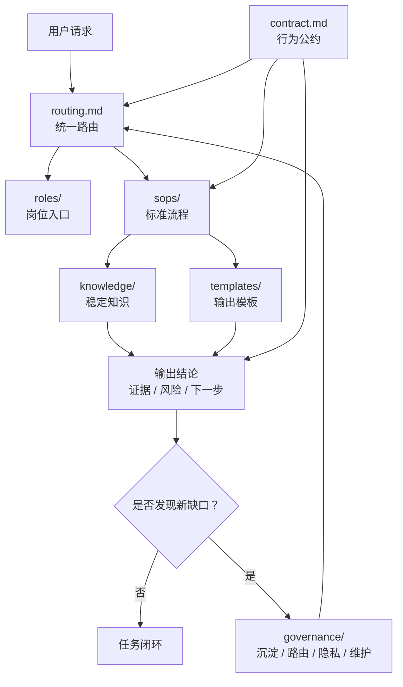

# Agents SOP Starter

> 通用、去业务化、可分享的 Agent SOP 底座。
> 目标：让不同岗位能在同一套底座规则下创建、执行、沉淀自己的 SOP。

## 结论

这是一套最小可用底座，不包含任何业务资料、客户资料、账号密钥或个人路径。

它保留的是“让 Agent 稳定参与流程”的通用结构：

| 底座能力 | 文件 / 目录 | 解决什么 |
|------|------|------|
| 行为公约 | `contract.md` | 约束输出、证据、安全边界和交付自检 |
| 任务路由 | `routing.md` | 从一句话请求定位岗位、SOP 或治理入口 |
| 岗位入口 | `roles/` | 描述谁负责、什么时候接管、常用 SOP 是什么 |
| 标准流程 | `sops/` | 保存可重复执行、可培训、可检查的 SOP |
| 知识沉淀 | `knowledge/` | 保存稳定经验、术语、口径和事实 |
| 底座治理 | `governance/` | 管理沉淀、隐私、路由维护和版本维护 |
| 复制模板 | `templates/` | 快速创建岗位卡、SOP、知识卡和路由项 |
| 本地接入 | `config-templates/` | 让 Codex / Claude / 其他 Agent 接入本底座 |

## 底座架构



一句话理解：

```text
contract 负责边界，routing 负责找路，roles 负责岗位入口，
sops 负责流程执行，knowledge 负责事实沉淀，governance 负责持续补缺口。
```

## 目录结构

```text
agents-sop-starter/
├── README.md
├── contract.md
├── routing.md
├── roles/
│   ├── README.md
│   └── qa.example.md
├── sops/
│   ├── README.md
│   └── qa/
│       └── functional-test-sop.example.md
├── knowledge/
│   └── README.md
├── governance/
│   ├── maintenance-rules.md
│   ├── privacy-and-share-boundary.md
│   ├── routing-maintenance.md
│   └── sedimentation.md
├── templates/
│   ├── decision-record.template.md
│   ├── knowledge-card.template.md
│   ├── role-card.template.md
│   ├── route-entry.template.md
│   └── sop.template.md
└── config-templates/
    ├── agent-entry.template.md
    └── local-config.example.jsonc
```

## 推荐读取顺序

1. `README.md`
2. `contract.md`
3. `routing.md`
4. 按任务读取对应 `roles/`、`sops/`、`knowledge/` 或 `governance/`

## 一句话如何展开成 SOP

示例请求：

```text
按客服反馈处理流程分析这个用户问题。
```

底座展开方式：

```text
用户请求
  ↓
routing.md 命中：客服反馈 / 问题处理
  ↓
读取 roles/customer-support.md，确认岗位边界
  ↓
读取 sops/customer-support/feedback-triage.md，进入标准流程
  ↓
按 SOP 输出结论、证据、风险、下一步
  ↓
如果发现路由不准或流程缺口，回写 governance/
```

注意：上面的岗位和 SOP 是示例，团队接入后按自己的真实流程创建。

## 最小使用流程

1. 复制整个 `agents-sop-starter/` 到团队共享目录或项目本地 `.agents/` 下。
2. 用 `templates/role-card.template.md` 创建岗位卡，放到 `roles/<role-name>.md`。
3. 用 `templates/sop.template.md` 创建 SOP，放到 `sops/<domain>/<sop-name>.md`。
4. 在 `routing.md` 增加触发词和入口文件。
5. 执行后把稳定经验写入 `knowledge/`，把规则调整写入 `governance/`。

如果想先看完整样例：

1. 读取 `roles/qa.example.md`。
2. 读取 `sops/qa/functional-test-sop.example.md`。
3. 观察一个岗位入口如何挂载具体 SOP。
4. 再把示例复制成自己的岗位和流程。

## 不包含什么

- 真实业务流程细节
- 客户、订单、项目、系统、库表、接口等业务资料
- 账号、密码、token、cookie、证书、连接串
- 个人本机绝对路径
- 一次性排查记录、临时脚本和历史噪音

## 核心工作闭环

```text
用户请求
  ↓
routing.md 定位入口
  ↓
读取岗位卡 roles/
  ↓
执行 SOP sops/
  ↓
输出结论、证据、风险、下一步
  ↓
稳定经验沉淀到 knowledge/
  ↓
必要时更新 routing.md / governance/
```

## 从哪里开始最合适

不要一上来追求大而全。优先选择一个高频、边界清晰、经常重复踩坑的流程。

| 角色 | 适合先沉淀的 SOP 示例 |
|------|----------------------|
| 产品 | 需求评审、需求变更确认、上线验收清单 |
| 测试 | 功能验收、Bug 回归、线上反馈分诊 |
| 开发 | 代码评审、自测清单、发布前检查 |
| 运维 | 告警分诊、变更检查、故障复盘 |
| 客服 | 反馈分流、用户回复、升级转交 |
| 数据分析 | 指标口径确认、报表交付、自检清单 |

判断一个 SOP 是否值得沉淀，先看 4 点：

| 判断点 | 说明 |
|--------|------|
| 是否高频 | 下次还会不会再发生 |
| 是否容易漏 | 不沉淀是否会重复走弯路 |
| 是否有标准输入输出 | 能不能写清楚开始条件和结束标准 |
| 是否能验证 | 执行结果有没有证据、风险和下一步 |

## 适合谁用

适合任何需要把个人经验整理为岗位 SOP 的团队，例如：

- 产品
- 测试
- 开发
- 运维
- 客服
- 数据分析
- 项目管理

岗位只需要各自补充自己的 SOP 内容，不需要改底座结构。

