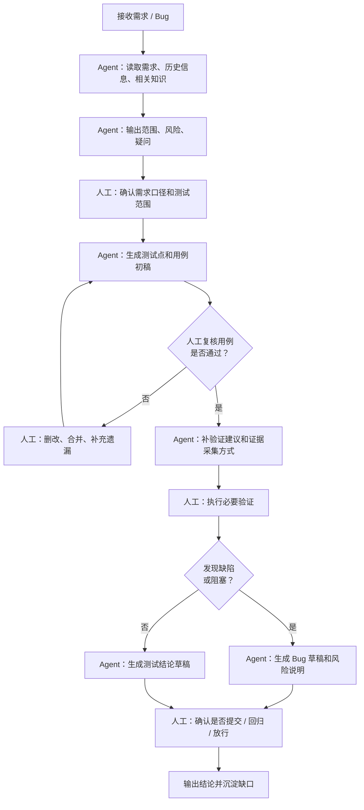

# functional-test-sop.example

status: example
owner: `<team-or-role-owner>`
last_updated: `<yyyy-mm-dd>`
related_role: `../../roles/qa.example.md`

> 示例 SOP。复制为 `sops/qa/functional-test-sop.md` 后再按团队真实流程修改。

## 1. 适用场景

适用于新需求、功能优化、Bug 修复后的功能验收。

## 2. 不适用场景

- 需求口径不清，无法判断验收范围。
- 目标环境不可用。
- 需要生产写操作或外部系统真实通知，但尚未获得确认。

## 3. 输入

执行前需要：

- 需求 / Bug / 任务链接
- 需求文档或补充说明
- 目标环境
- 已知风险或重点关注项

## 4. 主流程

## 5. Agent 负责

- 读取资料
- 拆测试点
- 生成用例初稿
- 补验证建议
- 整理证据
- 生成 Bug 或结论草稿
- 提醒风险和未确认项

## 6. 人工负责

- 确认需求口径
- 复核和补充用例
- 执行必要人工验证
- 判断问题是否成立
- 决定是否提交 Bug、是否回归、是否放行

## 7. 输出

默认输出：

- 测试结论
- 测试范围
- P0/P1 测试点
- 已执行验证
- 缺陷或阻塞
- 遗留风险
- 下一步动作

## 8. 验收标准

满足以下条件才算完成：

- 需求范围已确认
- 核心测试点已覆盖
- 必要人工验证已执行
- 结论与证据一致
- 未确认项和风险已说明

## 9. 沉淀规则

执行后如发现稳定经验：

- 流程变化：更新本 SOP
- 稳定口径：写入 `../../knowledge/`
- 路由变化：更新 `../../routing.md`
- 隐私或分享边界问题：更新 `../../governance/privacy-and-share-boundary.md`

