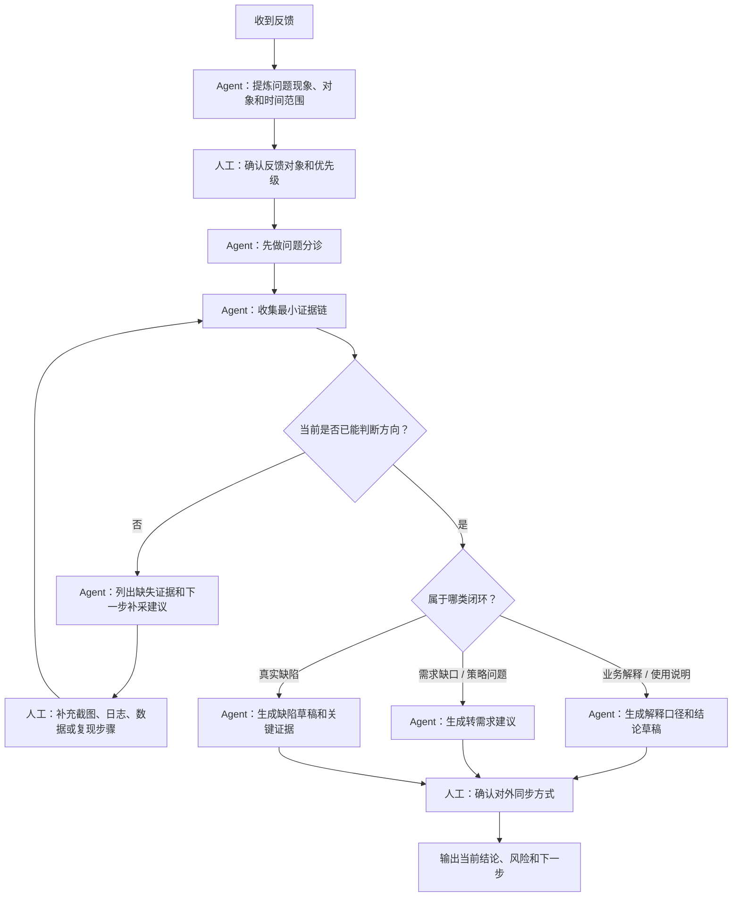

# issue-feedback-analysis-sop.example

status: example
owner: `<team-or-role-owner>`
last_updated: `<yyyy-mm-dd>`
related_role: `../../roles/qa.example.md`

> 示例 SOP。复制为 `sops/qa/issue-feedback-analysis-sop.md` 后再按团队真实流程修改。

## 1. 适用场景

适用于用户、业务、客服、测试或运营反馈的问题分析，包括功能异常、配置不生效、数据差异和待确认缺陷。

## 2. 不适用场景

- 当前只是常规功能验收，不需要做反馈分诊
- 缺少最小对象、时间范围和问题现象，且暂时无法补齐
- 已经进入专项性能、容量或基础设施事故处理

## 3. 输入

执行前需要：

- 反馈原文、截图、录屏或错误提示
- 时间范围、影响对象、目标环境
- 可复现入口、样本对象或最小触发路径

## 4. 主流程

## 5. Agent 负责

- 复述问题对象和现象
- 做第一轮分诊
- 收集和整理最小证据链
- 区分已证实、待确认和环境阻断
- 生成结论、解释口径或缺陷草稿

## 6. 人工负责

- 判断反馈是否成立
- 补充上下文和证据
- 决定是解释、转需求还是提缺陷
- 决定是否对外同步、升级或继续跟进

## 7. 输出

默认输出：

- 当前结论
- 已确认现象
- 关键依据
- 待确认项或环境阻断
- 下一步动作和责任归属

## 8. 验收标准

满足以下条件才算完成：

- 已明确问题对象、范围和类型
- 结论能区分事实、推测和待确认项
- 已明确当前闭环方式或下一步责任归属

## 9. 关联知识卡

- `../../knowledge/testing/triage-rules.knowledge.md`
- `../../knowledge/testing/defect-writing.knowledge.md`
- `../../knowledge/testing/result-layering.knowledge.md`

## 10. 沉淀规则

执行后如发现稳定经验：

- 流程变化：更新本 SOP
- 稳定口径：写入 `../../knowledge/`
- 路由变化：更新 `../../routing.md`
- 隐私或分享边界问题：更新 `../../governance/privacy-and-share-boundary.md`
